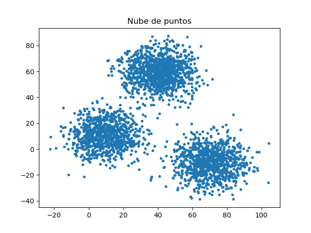
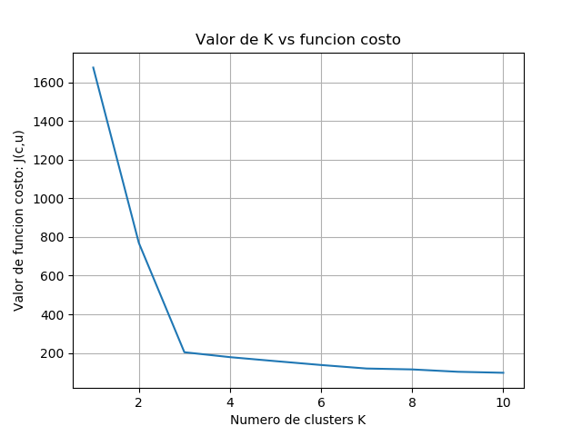

# K-means-Laboratorio-de-IA
---

Tarea de curso laboratorio de IA
- Implementacion del algoritmo k-means
- Implementacion de la funcion costo
- Implementacion de Elbow
- Implementacion de metodos para determinar el valor de K(cantidad de grupos)

Todo el codigo esta en el archivo **algoritm_kmeans.py**
El archivo de datos que se usa es **exclara.csv**
